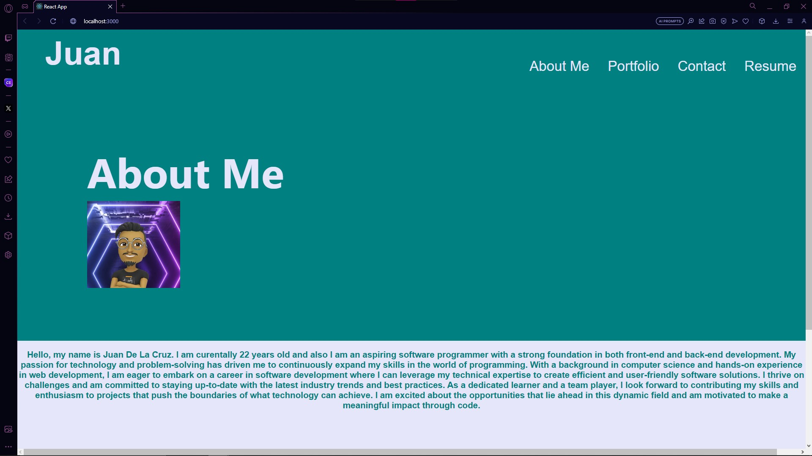

# REACT Portfolio 

## Table of Contents
  * [Description](#description)
  * [Installation](#installation)
  * [Executing-Program](###Executing-Program)
  * [Demonstration](###Demonstration)
  * [Questions](#questions)
  * [License](#license)
  


## Description:
  This is my new and updated code for my portfolio to help provide myself a website that hiring managers can look at to see how far I have come with this Coding Boot Camp course. It shows a little bit about myself, my projects, a way to contact me, and my resume that includes my expierence and the type of coding I understand(Front-End and Back-End)


## Getting Started

### Installation

Install the dependencies
```
   npm install 
```

### Executing-Program
Run this command in the terminal under index.js

```
   npm start
```


### Demonstration


[juansoftware](https://juanitosoftware.com)


### Questions
* Github: MijitoJuanito
* Email: j.v.delcruz70120@gmail.com


## Authors


Juan De La Cruz  


## License

MIT License

Copyright (c) 2023 MijitoJuanito

Permission is hereby granted, free of charge, to any person obtaining a copy
of this software and associated documentation files (the "Software"), to deal
in the Software without restriction, including without limitation the rights
to use, copy, modify, merge, publish, distribute, sublicense, and/or sell
copies of the Software, and to permit persons to whom the Software is
furnished to do so, subject to the following conditions:

The above copyright notice and this permission notice shall be included in all
copies or substantial portions of the Software.

THE SOFTWARE IS PROVIDED "AS IS", WITHOUT WARRANTY OF ANY KIND, EXPRESS OR
IMPLIED, INCLUDING BUT NOT LIMITED TO THE WARRANTIES OF MERCHANTABILITY,
FITNESS FOR A PARTICULAR PURPOSE AND NONINFRINGEMENT. IN NO EVENT SHALL THE
AUTHORS OR COPYRIGHT HOLDERS BE LIABLE FOR ANY CLAIM, DAMAGES OR OTHER
LIABILITY, WHETHER IN AN ACTION OF CONTRACT, TORT OR OTHERWISE, ARISING FROM,
OUT OF OR IN CONNECTION WITH THE SOFTWARE OR THE USE OR OTHER DEALINGS IN THE
SOFTWARE.


